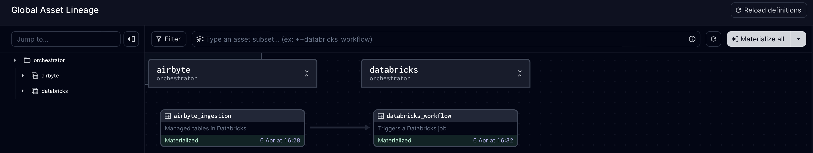

# formula-one-project

## Table of Contents
- [Introduction](#introduction)
- [Solution Architecture](#solution-architecture)
- [Project Components](#project-components)
    - [Source](#source)
    - [Data Ingestion](#data-ingestion)
    - [Storage](#storage)
    - [Transformation](#transformation)
    - [Orchestration](#orchestration)
    - [Serving](#serving)
- [CI/CD](#cicd)

## Introduction
As the highest class of international racing for single-seater formula racing cars, Formula 1 is the pinnacle of motorsport and the world’s most prestigious motor racing competition. In this team sport, drivers compete for the esteemed F1 Drivers’ Championship, while the teams fight for the F1 Constructors’ Championship and prize money based on their position at the end of the season.

In this project, we aim to create an ELT pipeline that will help F1 enthusiasts answer the following questions:
1. Who was the champion driver in each year from 1950 till 2023?
2. Who was the champion constructor in each year from 1950 till 2023?
3. How were the drivers classified in each of the years between 1950 and 2023?
4. How were the constructors classified in each of the years between 1950 and 2023?
5. Which countries had the most races?
6. What are the most dangerous circuits? 

## Solution Architecture

**Figure 1**: Solution architecture

## Project Components

### Source
The source database corresponds to a PostgreSQL database hosted in an Amazon RDS instance. This database is responsible for storing Formula 1 data from 1950 until the last season of 2023. This data was obtained from the Kaggle platform [here](https://www.kaggle.com/datasets/rohanrao/formula-1-world-championship-1950-2020/data).

It is important to note that only a subset of all available data was used in this project, including information on races, drivers, constructors, circuits and championships.

### Data Ingestion
Airbyte was the data integration tool used in this project, being hosted on an Amazon EC2 instance. It is responsible for connection to the PostgreSQL database and performing an incremental extract on all tables.

In order to perform an incremental extract, an `updated_at` column was added to all tables to denote the timestamp at which the record(s) for a given table was last updated. This field acts as the cursor column for the `Incremental - append` sync mode.

**Figure 2**: Airbyte ingestion

At the time of this project, it is important to note that not all Airbyte sync modes are supported when ingesting data into Databricks Lakehouse. More specifically, only `Full Refresh` and `Incremental - append` are supported. Visit this [link](https://docs.airbyte.com/integrations/destinations/databricks/#sync-mode) for more information.

### Storage
Databricks Lakehouse is the destination where the extracted data from the F1 PostgreSQL database is loaded for analytical processing. The data is loaded in Databricks as Delta Tables (default data table format in Databricks and is a feature of the Delta Lake open source data framework).

### Transformation
The data loaded from Airbyte into Databricks forms the Bronze layer. This data is then read and undergoes the following transformations before forming the Silver layer:
- Flatten JSON fields
- Deduplication
- Field rename
- Data type casting

Before the data is loaded into the Silver layer, data quality checks were performed using Great Expectations, ensuring that:
- Primary keys and foreign keys are not null
- Values are within the expected range (for example, latitude and longitude are between [-90, 90] and [-180, 180], respectfully)
- Values are within the expected set (for example, data includes races for years between 1950 and 2023)

When loading data into the Silver layer, it is important to note that:
- Surrogate keys are created
- The data is loaded via upsert operation

Lastly, the Gold layer is created by reading data from the Silver layer and performing additional transformations such as `joins`, `field renaming` (to follow business definitions or requirements), `calculations`, and so on.

The Gold layer can be represented by the following Entity Relationship Diagram (ERD):

**Figure 3**: Gold layer - Entity Relationship Diagram (ERD)

In the Gold layer, there was also created a one big table (OBT) to feed the Preset Dashboard.

### Orchestration
Dagster was the orchestration tool used in this project and it was deployed using [Dagster Cloud](https://dagster.io/cloud). Unlike other orchestration tools such as Airflow and Prefect, Dagster introduces an asset-based orchestration approach.

As with many Data Engineering projects, there are many ways to orchestrate the data pipeline. More specifically, 3 different approaches were considered:
1. Databricks Workflow: Create a Databricks notebook that triggers an Airbyte sync and additional notebooks that perform data transformations. These notebooks would be called in the correct order by the workflow
2. Dagster Asset Job: Create an Airbyte asset and a Databricks custom asset. These two assets would be selected to form an asset job that would be scheduled to run by Dagster
3. Dagster Auto-materialize assets: Create an Airbyte asset and a Databricks custom asset. Define and attach auto-materialize policies on these assets. Dagster will automatically materialize these assets when the specified criteria are met

In this project, we implemented both approach 2 and 3 in order to learn more about the Dagster tool. In these approaches, Dagster is responsible for calling first the Airbyte connection and then the  Databricks workflow illustrated below.

**Figure 4**: Databricks Workflow

The Dagster Global Asset Lineage looks as follow:

**Figure 5**: Dagster Global Asset Lineage

Example of Dagster auto-materialize assets feature:

**Figure 6**: Dagster Auto-materialize

As mentioned earlier, this project also allows you to run the pipeline through asset jobs:

**Figure 7**: Dagster asset job

Pipeline run results are sent to Slack for easy monitoring:

<!--  -->
<image src="images/dagster-slack-log.png" width="500">

**Figure 8**: Dagster Slack log message

**Important notes**:
1. Airbyte provides an official integration with Dagster (see [here](https://docs.airbyte.com/operator-guides/using-dagster-integration#:~:text=Airbyte%20is%20an%20official%20integration,project%20can%20be%20found%20here.)). However, at the time of this project, Auto-materialize asset is not working for Airbyte integration. See this [GitHub issue](https://github.com/dagster-io/dagster/issues/18266). For this reason, a custom asset was created for Airbyte, although an official integration was already provided.
2. At the time of this project, Dagster does not allow the creation of asset jobs that involve selecting regular assets (Databricks custom asset) and external assets (official Airbyte integration). This is yet another reason to create a custom asset for Airbyte.

### Serving
A Preset Dashboard was created to help F1 enthusiasts answer the questions described in the [Introduction](#introduction) section. The Dashboard includes 4 tabs:
1. Overview: describes the purpose of the dashboard and the data feeding it
2. Driver: provides information about champion drivers, driver points and drivers classification per season
3. Constructor: provides information about champion constructors, constructors points and constructors classification per season
4. Circuit: relies information about race locations and most dangerous circuits

**Figure 9**: Preset Dashboard

## CI/CD
GitHub Actions is used to trigger CI/CD pipeline:
- linter workflow is responsible for flagging improperly formatted SQL and Python code
- Serveless branch deployment is responsible for creating staging environments of the Dagster code, right in Dagster Cloud. For every push to a branch in the git repository, Dagster Cloud will create a unique deployment, allowing you to preview the changes in the branch in real-time. For more information, visit the [docs](https://docs.dagster.io/dagster-cloud/managing-deployments/branch-deployments)
- responsible for deploying to Dagster cloud. Pushing to the main branch will deploy to prod Serverless deployment

**Figure 10**: Example of CI/CD workflows
